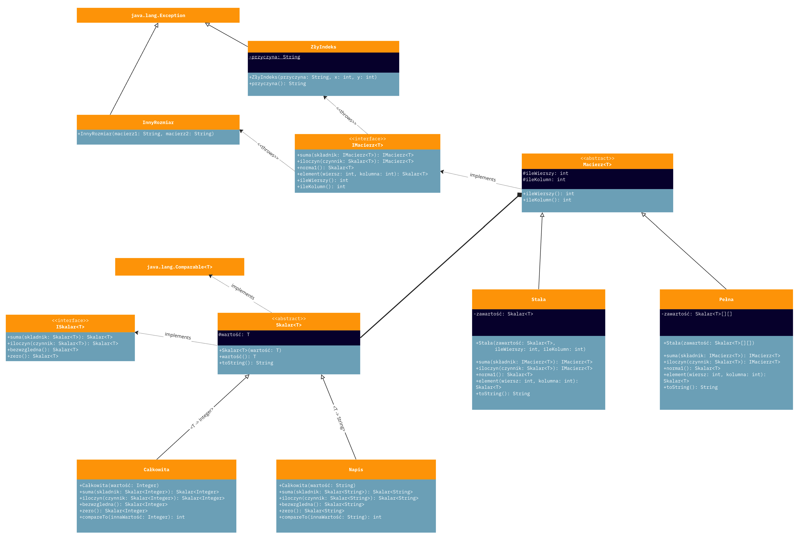

# Macierze
Biblioteka implementująca operacje na macierzach i skalarach, w ramach rozwiązania zadania zaliczeniowego z przedmiotu: <i>Programowanie i projektowanie obiektowe</i>.

## Polecenie
Zaprojektowanie biblioteki implementującej macierze - będące dwuwymiarową tablicą <i>Skalarów</i> (Skalarami mogą być liczby różnego typu, a także napisy).

[Skalary](skalary) muszą realizować operacje:
* sumy,
* iloczynu (w przypadku napisu: <i>abc</i> * <i>de</i> = <i>adebdecde</i>),
* wartości bezwzględnej;
oraz posiadać element zerowy.

[Macierze](macierze) muszą być sparametryzowane typem Skalarów, i realizować operacje:
* suma dwóch macierzy,
* iloczyn macierzy przez skalar,
* norma (pierwsza) macierzy (tj. maksimum po kolumnach z sum wartości bezwzględnych elementów w kolumnie),
* zwrócenie elementu o zadanym numerze wiersza i kolumny,
* zwrócenie liczby swoich wierszy,
* zwrócenie liczby swoich kolumn.

Biblioteka musi realizować poniższy [kod](główny/Główna.java):
```java
Integer n = 2;
Integer m = 3;

Całkowita[][] daneC1 = new Całkowita[n][m];
Całkowita[][] daneC2 = new Całkowita[n][m];

Napis[][] daneN1 = new Napis[n][m];
Napis[][] daneN2 = new Napis[n][m];

for(int i=0; i<daneC1.length; i++)
    for(int j=0; j<daneC1[0].length; j++) {
        daneC1[i][j] = new Całkowita(i * daneC1[0].length + j);
        daneC2[i][j] = new Całkowita(2*(i * daneC2[0].length + j));
        daneN1[i][j] = new Napis("" + (char)('a'+((i * daneN1[0].length + j)%('z'-'a'+1))));
        daneN2[i][j] = new Napis("" + (char)('a'+((2*(i * daneN2[0].length + j))%('z'-'a'+1))));
    }

IMacierz<Integer> mpc = new Pełna<>(daneC1);
IMacierz<String> mpn = new Pełna<>(daneN1);
IMacierz<Integer> msc = new Stała<>(new Całkowita(3), n, m);
IMacierz<String> msn = new Stała<>(new Napis("b"), n, m);
```

## Diagram UML

